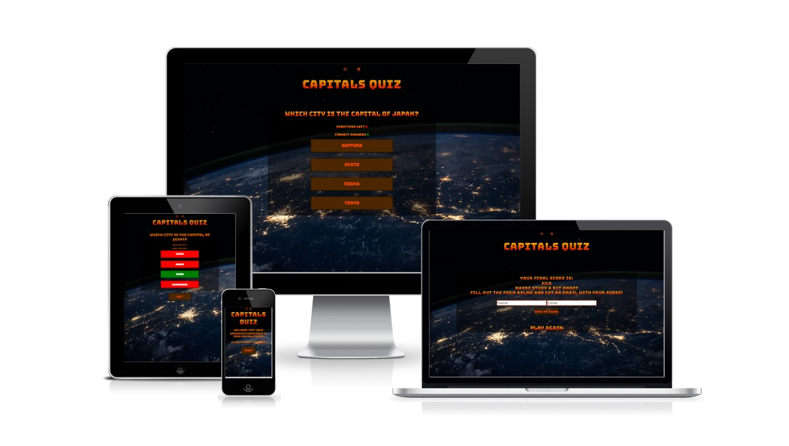
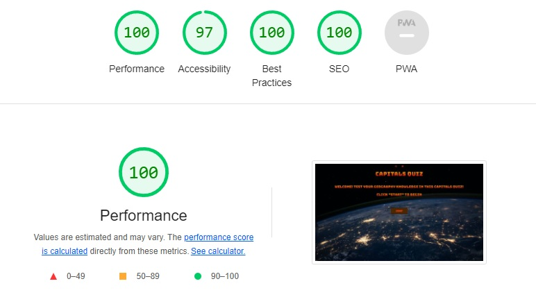

# Capitals Quiz | Portfolio Project 2 - JavaScript Essentials
[Live site](https://fullstacksammy.github.io/geography-quiz/)

This is site is a quiz game for any geography nerd out there. It focuses on the Capital cities of the world. 10 questions needs to be answered and you will be able to recieve an email with the result of your game. Capitals Quiz is a one page site with beautiful background and color contrasts, that makes it inriguing to anyone who firsts arrives on the site. The page is fully responsive and fun to play. It gives you 4 alternatives per question and will show you whether they're right or wrong.

 

## **Features** 
---
### **Heading**
On the top of the site, you will find the heading. Which concists of:
- Links to the Github repository and my Linkedin profile
- The title of the site (when clicked, refreshes the site).

 
 

### **The information text**
- Quick information on what the game is about and what you need to do to start the game.

 

### **The Start Button**
- The start button starts the game when clicked.

 

### **The Game Box**
This game box shows up after you click start button. it contains:
- The question at the top
- Two counters which are the following:
    - Question counter (Counts how many questions are left)
    - Correct Answer counter (Counts how many correct answers you have)
- The 4 different answers to choose from

The game box is responsive and when an answer is chosen, the colors of the answers will change to either red or green, reveiling the correct answer.

 

### **The Next Button**
The next button shows up at the bottom of the page when you have chosen an answer and clicking it takes you to the next question of the game.

 

### **The Results Button**
The Results button shows up when all questions have been answered and the game is over. Clicking it will show the result box.

 

### **The Result Box**
The Result box is the last thing showing of the page. It contains different features, which are the following:
- Finalscore text (Contains your results, and information about the email form below it)
- The Email form (if filled out, it sends you a thank you email with your score. Both fields are required or an alert will show.) and an alert will show once an email is sent.
- The Play again button (if clicked, reloads the page and takes you back to the main section.)

 

### **Bugs & Fixes**
I had an error where my background-image didn't now show in my deployed project on GitHub. fixed it by writing "background-image: url(../images/background.jpg);" instead of "background-image: url(/assets/images/background.jpg);"

another bug I encountered were that the view height for iPad Mini where cropped of. I fixed it by changing the bodys viewheight on media query `@media only screen and (min-width: 481px) and (max-width: 768px) {
    body {
        height: 100vh;
    }` 

## **Testing**
---
### **HTML**
- I tested the HTML code of my project on [W3C HTML validator](https://validator.w3.org/nu/) and found no errors.

### **CSS**
I tested my CSS code on [W3C CSS validator](https://jigsaw.w3.org/css-validator/) and found no errors.

### **JavaScript**
- I tested my JavaScript code on [beautifytools](https://beautifytools.com/javascript-validator.php) and found no errors. There were a warning though:
    - Said that emailjs in my addEventListener for the sendButton was not defined. But that is code used with the EMAILJS template. So I ignored it. 

### **Accessibility**
- I have confirmed that this site is responsive, by using css grid layout and media queries to size it to different resolutions.

- I have made sure it works on Chrome, Safari and Firefox. I have also tested the website on different physical devised and made sure the site works on them. These are:
    - Iphone 13 pro
    - Samsung Galaxy S21
    - Samsung Galaxy S22

- The form works as it's supposed to. I have used the template from [EmailJS](https://www.emailjs.com) and you can't recieve and email with your score unless you fill out all the required fields.
I made sure that the colors I used are easy to read and go well together. and I tested it on lighthouse in devtools.

 

## **Unfixed Bugs**
---
There are no unfixed bugs.

## **Deployment**
---
The site is deployed to GitHub pages and to deploy it you need to do the following:
- Go to your repositories and click on the one you want to deploy
- Click the settings option
- Choose "Pages" in the menu to the left
- Choose "Deploy from a branch" and when choosing branch, choose the branch named "main"
- Lastly, click the "save" button
You can find the live link to my site [here](https://fullstacksammy.github.io/geography-quiz/).

## **Credits**
---
### **Content**
This are the credits for code usage:
- The email form template used by signing up on [EmailJS](https://www.emailjs.com). You sign up, make an email template and then you can use that in your code to send out emails. 
- The animations used is taken from CI [Love running project](https://github.com/Code-Institute-Org/love-running-2.0).
- The counters functions for the game, named "incrementScore" and "incrementQuestionCount" were both inspired by and borrowed from CI [Love Maths Project](https://github.com/Code-Institute-Org/love-maths).

### **Media**
All images used in this project were taken from the free image site [unsplash](https://www.unsplash.com).

