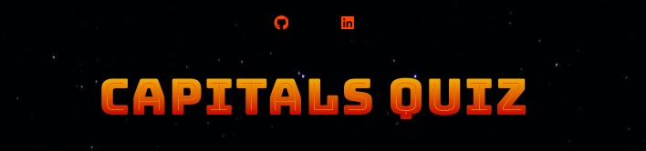
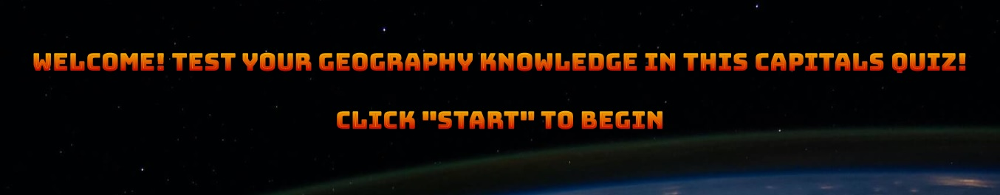
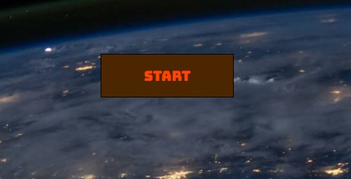
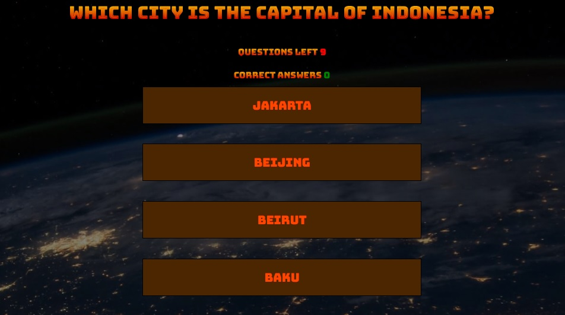
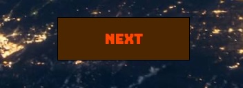
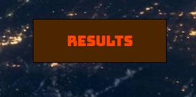
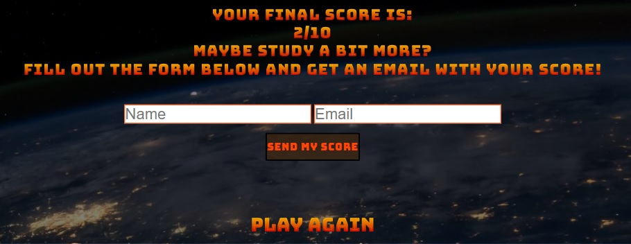

# Capitals Quiz | Portfolio Project 2 - JavaScript Essentials
[Live site](https://fullstacksammy.github.io/geography-quiz/)

This is site is a quiz game for any geography nerd out there. It focuses on the Capital cities of the world. 10 questions needs to be answered and you will be able to recieve an email with the result of your game. Capitals Quiz is a one page site with beautiful background and color contrasts, that makes it inriguing to anyone who firsts arrives on the site. The page is fully responsive and fun to play. It gives you 4 alternatives per question and will show you whether they're right or wrong.

## **Features** 
---
### **Heading**
On the top of the site, you will find the heading. Which concists of:
- Links to the Github repository and my Linkedin profile
- The title of the site (when clicked, refreshes the site).

 
 

### **The information text**
- Quick information on what the game is about and what you need to do to start the game.

 

### **The Start Button**
- The start button starts the game when clicked.

 

### **The Game Box**
This game box shows up after you click start button. it contains:
- The question at the top
- Two counters which are the following:
    - Question counter (Counts how many questions are left)
    - Correct Answer counter (Counts how many correct answers you have)
- The 4 different answers to choose from

The game box is responsive and when an answer is chosen, the colors of the answers will change to either red or green, reveiling the correct answer.

 

### **The Next Button**
The next button shows up at the bottom of the page when you have chosen an answer and clicking it takes you to the next question of the game.

 

### **The Results Button**
The Results button shows up when all questions have been answered and the game is over. Clicking it will show the result box.

 

### **The Result Box**
The Result box is the last thing showing of the page. It contains different features, which are the following:
- Finalscore text (Contains your results, and information about the email form below it)
- The Email form (if filled out, it sends you a thank you email with your score. Both fields are required or an alert will show.) and an alert will show once an email is sent.
- The Play again button (if clicked, reloads the page and takes you back to the main section.)

 

## **Bugs & Fixes**

bugs and fixes.
I had an error where my background-image didn't now show in my deployed project on GitHub. fixed it by writing "background-image: url(../images/background.jpg);" instead of "background-image: url(/assets/images/background.jpg);"

another bug I encountered were that the questionCounter function continued to count down below zero even when the game was restarted. I 